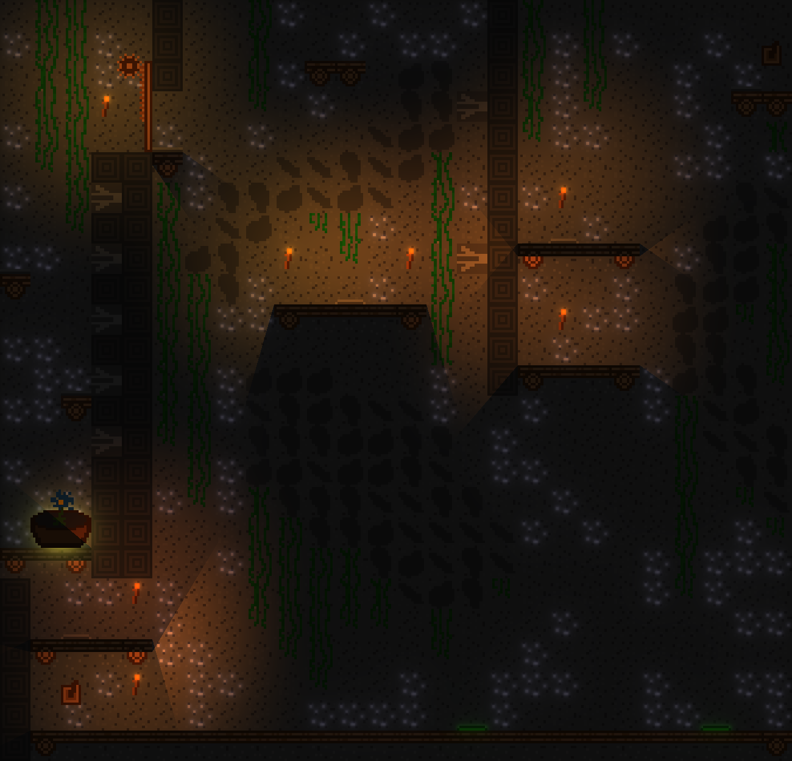

# Replayed
Replayed the game was created during "Jamsepticeye" game jam in October 2025. It's a 2D Platformer in which you replay the level multiple times to solve it. Replayed was written in C++ using OpenGL and a custom renderer. It contains 5 levels you need to clear as fast as possible.

## Screenshots

